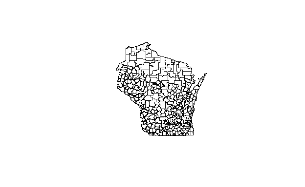
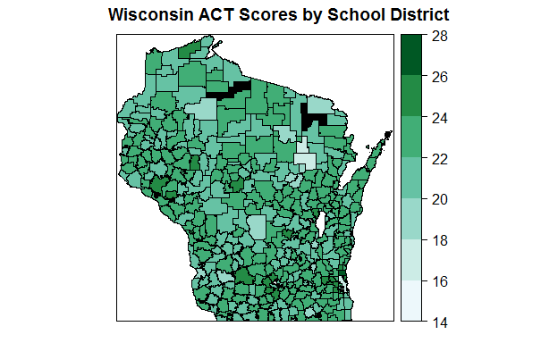
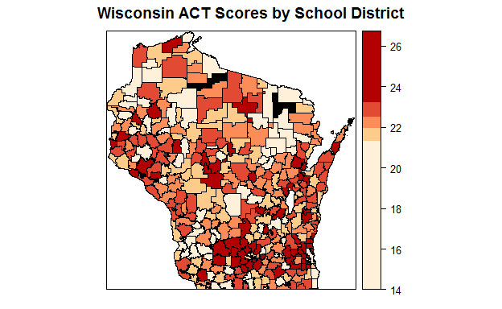

# Visualizing Wisconsin ACT Scores with a Map in R
Sam Veverka  
25 March 2017  


#Introduction
This script is an attempt to utilize R to display spatial data. I will be using data from the Wisconsin Department of Public Instruction. To create the map, I will use the Wisconsin school district geospatial files (GIS Shapefiles) which are posted on the DPIs website. 

The GIS shapefiles can be found at:
https://dpi.wi.gov/gis/school-district-boundaries/data

I will be mapping district comprehensive ACT scores, which can be found on the DPI's website as well: https://dpi.wi.gov/wisedash/download-files/type?field_wisedash_upload_type_value=ACT&field_wisedash_data_view_value=All

I used Robin Lovelace's "Introduction to visualising spatial data in R" as a reference for this project. I recommend it for anyone looking for a comprehensive guide to creating maps in R. https://cran.r-project.org/doc/contrib/intro-spatial-rl.pdf

#Set Working Directory and Load Map Data

I load the libraries necessary to load GIS data. I then use the readOGR function to load the data from the set of GIS files.

```r
setwd("C:\\Users\\Samuel\\Documents\\R\\Excel Practice Sheets\\maps_tutorial\\WPI")
library(rgdal)
library(rgeos)

district_map <- readOGR(dsn = ".", layer = "tl_2013_55_unsd_scsd_harn")
```


It's a good idea to check the map data and make sure that the files are complete and that you have a good understanding of what different variables are included. If you are need more information than the variable names, I recommend opening the GIS files in a GIS software package, some of which are free online. 


```r
names(district_map)
```

```
##  [1] "STATEFP"    "UNSDLEA"    "GEOID"      "NAME"       "LSAD"      
##  [6] "LOGRADE"    "HIGRADE"    "MTFCC"      "ALAND"      "AWATER"    
## [11] "INTPTLAT"   "INTPTLON"   "SCSDLEA"    "NCES_CODE"  "DIST_NAME" 
## [16] "DIST_CODE"  "CESA_NAME"  "CESA"       "ATH_CON"    "ATH_CON_NO"
## [21] "Shape_Leng" "Shape_Area"
```

```r
plot(district_map)
```

<!-- -->

The map data includes the school district codes. The codes could be useful as they could tie the information between the map data with any data sets one would like to plot.


```r
head(district_map$DIST_CODE)
```

```
## [1]  485 4904    7 2415 1071   14
```


#Load ACT Data and Merge to Map Data

I will now load the the district average comprehensive ACT scores for this exercise.


```r
act <- read.csv("act.csv", stringsAsFactors = FALSE, header = TRUE)
names(act)
```

```
##  [1] "SCHOOL_YEAR"    "AGENCY_TYPE"    "CESA"           "COUNTY"        
##  [5] "DISTRICT_CODE"  "SCHOOL_CODE"    "GRADE_GROUP"    "CHARTER_IND"   
##  [9] "DISTRICT_NAME"  "SCHOOL_NAME"    "TEST_SUBJECT"   "TEST_RESULT"   
## [13] "GROUP_BY"       "GROUP_BY_VALUE" "STUDENT_COUNT"  "AVERAGE_SCORE" 
## [17] "GROUP_COUNT"
```


The ACT data has the district codes as well, which we can use to match the ACT scores to the appropriate school districts on the map.

To verify that all data matches, use the R operator %in% to compare the map district codes with the ACT data district codes. TRUE indicates there is a match between data sets. 


```r
matches <- district_map$DIST_CODE %in% act$DISTRICT_CODE
summary(matches)
```

```
##    Mode    TRUE    NA's 
## logical     378       0
```
The summary indicates that all district codes match between the data sets.

Use dplyr to merge ACT data to map the data.

```r
library(dplyr)

district_map@data <- left_join(district_map@data, act, by = c('DIST_CODE' = 'DISTRICT_CODE'))
```

Now I will check to verify that the data is merged. Also, I want to verify that we have ACT scores for all districts.

```r
names(district_map)
```

```
##  [1] "STATEFP"        "UNSDLEA"        "GEOID"          "NAME"          
##  [5] "LSAD"           "LOGRADE"        "HIGRADE"        "MTFCC"         
##  [9] "ALAND"          "AWATER"         "INTPTLAT"       "INTPTLON"      
## [13] "SCSDLEA"        "NCES_CODE"      "DIST_NAME"      "DIST_CODE"     
## [17] "CESA_NAME"      "CESA.x"         "ATH_CON"        "ATH_CON_NO"    
## [21] "Shape_Leng"     "Shape_Area"     "SCHOOL_YEAR"    "AGENCY_TYPE"   
## [25] "CESA.y"         "COUNTY"         "SCHOOL_CODE"    "GRADE_GROUP"   
## [29] "CHARTER_IND"    "DISTRICT_NAME"  "SCHOOL_NAME"    "TEST_SUBJECT"  
## [33] "TEST_RESULT"    "GROUP_BY"       "GROUP_BY_VALUE" "STUDENT_COUNT" 
## [37] "AVERAGE_SCORE"  "GROUP_COUNT"
```


```r
district_map$AVERAGE_SCORE
```

The data appears to have merged correctly. However, there are missing ACT scores, which are marked with asterisks. We will have to impute values, or in this case, NA values. NA values are preferred to imputed values, as the plot is purely descriptive.


```r
district_map$AVERAGE_SCORE[district_map$AVERAGE_SCORE == "*"] <- NA
district_map$AVERAGE_SCORE <- as.numeric(district_map$AVERAGE_SCORE)
```

#Plot Map

The map will need a way to separate data into segments or intervals, so that data can be plotted with color in a meaningful way. I will start with perhaps the most straightforward method, assigning breaks at fixed intervals.

I will use classInt to form intervals to create breaks from.


```r
library(classInt)
breaks_quant <- classIntervals(district_map$AVERAGE_SCORE, n = 8, style = "fixed",
                               fixedBreaks = c(14,16,18,20,22,24,26,28))
breaks <- breaks_quant$brks
```

Also, I will use RColorBrewer to generate the color pallete for the plot.

```r
library(RColorBrewer)
pal <- brewer.pal(7, "BuGn")  # select 7 colors as there are 7 segments
```


We are now almost ready to create the plot. I will use latticeExtra so that I can plot NA values in a different color than actual scores. I will use black so that there is no confusing NA values with actual values, even if we change plot colors.


Now the data is ready to plot.

```r
spplot(district_map, "AVERAGE_SCORE", col.regions = pal, at = breaks, main = "Wisconsin ACT Scores by School District",
       colorkey = list(labels = list(labels= c("14","16","18","20","22","24","26","28"), width =2, cex = 1))) + 
  layer_(sp.polygons(district_map, fill='black'))
```

<!-- -->

Using fixed breaks, it is easy to see the districts with the very highest and lowest scores, but it is a little difficult to see trends. It is useful to segment the data in a differnt way which may provide more insight.

So in addition to splitting score by fixed intervals, I would also like to plot scores by quantiles. I will use five quantiles and use a different color pallete.

```r
breaks_quant <- classIntervals(district_map$AVERAGE_SCORE, n = 5, style = "quantile")
```

```
## Warning in classIntervals(district_map$AVERAGE_SCORE, n = 5, style =
## "quantile"): var has missing values, omitted in finding classes
```

```r
breaks <- breaks_quant$brks
```


```r
pal <- brewer.pal(5, "OrRd")  # select 5 colors from the palette
```


We are now ready to plot the data.


```r
spplot(district_map, "AVERAGE_SCORE", col.regions = pal, at = breaks, main = "Wisconsin ACT Scores by School District") +   layer_(sp.polygons(district_map, fill='black'))
```

<!-- -->

Splitting scores into five quantiles is informative, but most scores will be around the national composite average, 21, so the first and fifth quantile will incorporate a much largerspan of scores than the middle three quantiles as ACT scores have normal distribution.

There are now some score trends evident. It appears the districts in the suburbs around Madison and Milwaukee perform have the highest average score, while there are cluster of districs in Northeast and Southwest Wisconsin which contain average comprehensive scores in the first quantile.

#Conclusion

Although the map with fixed breaks displays the districts with highest and lowest comprehensive ACT scores, it appears that the map displaying quantiles is more informative, as it displays ACT performance across space better.

I do want to note that this exercise was an exploration of plotting map data rather than an analysis. A single map like this only plots one variable and is hence not very insightful. However, the addition of other data plotted in a similar fashion could help analysis, such as plotting socioeconomic background of students and comparing to ACT scoress
